# 1. 前言

Mermaid是一种基于文本的图表绘制工具，允许用户使用简单的文本描述创建各种图表。本文将详细介绍Mermaid的语法和使用方法。

&nbsp;
# 2. 基础语法

## 2.1. 图表定义

所有Mermaid图表都以以下格式开始：

```markdown
图表类型
  图表内容
```

## 2.2. 注释

使用`%%`添加注释，注释必须单独一行，不能添加到语句末尾：

```markdown
flowchart TD
  %% 这是一条注释
  A --> B
```

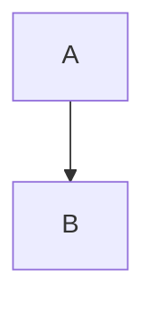

## 2.3. 图表方向

对于流程图、时序图等，可以指定图表方向：

- `TD` 或 `TB`: 从上到下
- `LR`: 从左到右
- `RL`: 从右到左
- `BT`: 从下到上

&nbsp;
# 3. 流程图 (Flowchart)

## 3.1. 基本形状

```markdown
flowchart TD
  A[矩形] --> B(圆角矩形)
  C{菱形} --> D[(数据库)]
  E>不对称矩形] --> F{{六边形}}
```

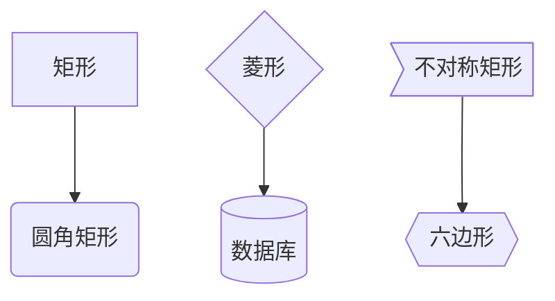

## 3.2. 连接线

```markdown
flowchart TD
  A --> B %% 实线箭头
  C --- D %% 实线无箭头
  E -- 文本 --> F %% 带文本的实线箭头
  G ---|文本| H %% 带文本的实线无箭头
  I -.-> J %% 虚线箭头
  K -. 文本 .-> L %% 带文本的虚线箭头
  M ==> N %% 粗实线箭头
  O == 文本 ==> P %% 带文本的粗实线箭头
```


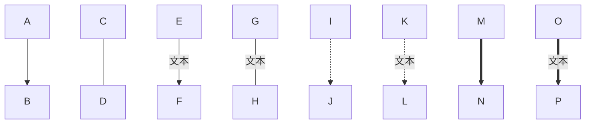

## 3.3. 子图表

```markdown
flowchart TD
  subgraph 子图表1
    A --> B
  end
  
  subgraph 子图表2
    C --> D
  end
  
  A --> C
```

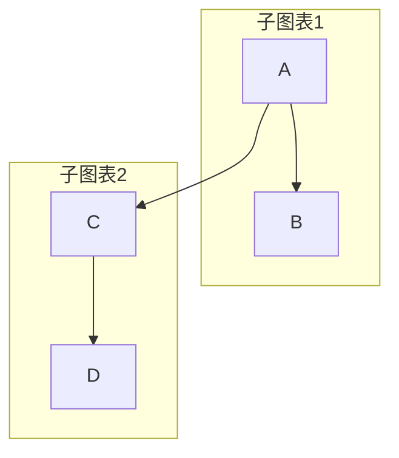

## 3.4. 复杂流程图示例

```markdown
flowchart TD
  A[开始] --> B{条件A}
  B -->|是| C[操作1]
  B -->|否| D[操作2]
  C --> E{条件B}
  D --> E
  E -->|是| F[操作3]
  E -->|否| G[操作4]
  F --> H[结束]
  G --> H
```

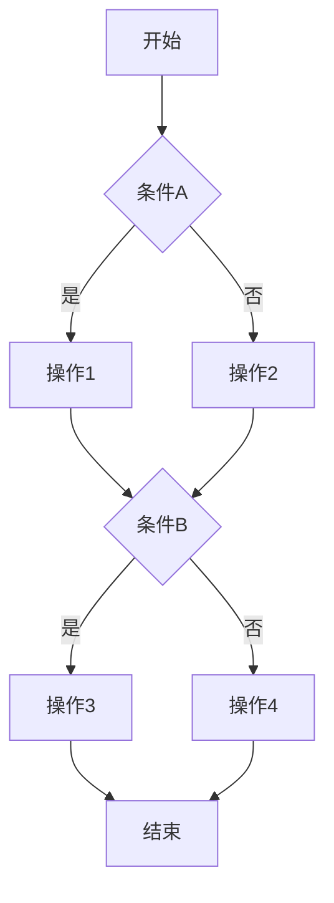

&nbsp;
# 4. 时序图 (Sequence Diagram)

## 4.1. 时序图基本结构

```markdown
sequenceDiagram
  participant A as 角色A
  participant B as 角色B
  
  A->>B: 消息1
  B-->>A: 响应1
  A->>B: 消息2
  B-->>A: 响应2
```

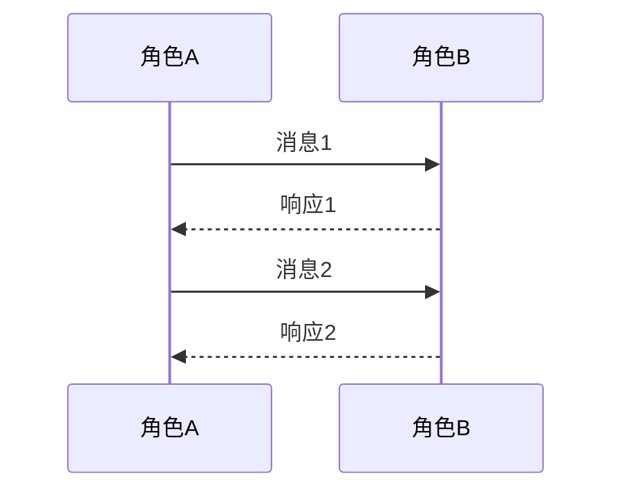

## 4.2. 消息类型

```markdown
sequenceDiagram
  participant A
  participant B
  
  A->B: 同步消息
  A-->>B: 返回消息
  A->>B: 异步消息
  A-xB: 失败消息
  A-)B: 虚线消息
```

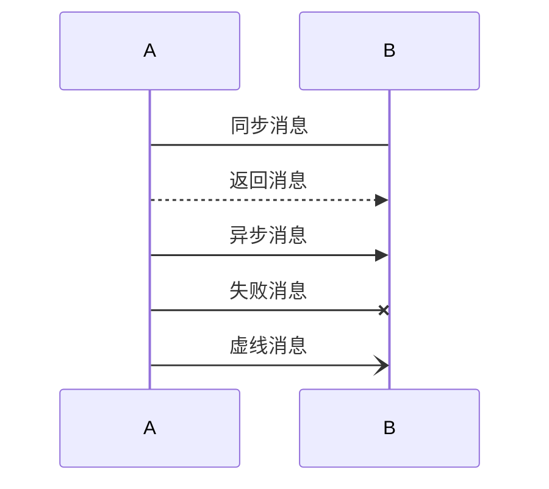

## 4.3. 激活状态

```markdown
sequenceDiagram
  participant A
  participant B
  
  A->>B: 消息
  activate B
  B-->>A: 响应
  deactivate B
```

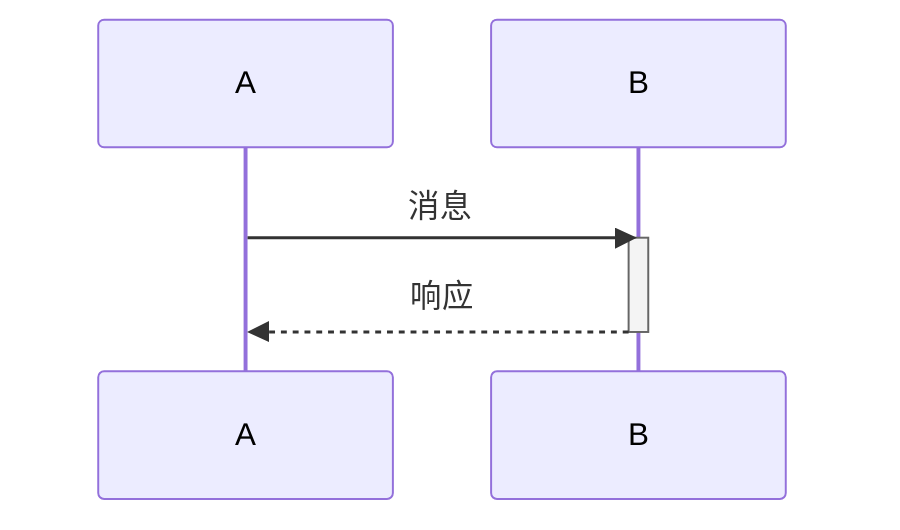

## 4.4. 循环和条件

```markdown
sequenceDiagram
  participant A
  participant B
  
  loop 循环条件
    A->>B: 循环消息
    B-->>A: 循环响应
  end
  
  alt 条件分支
    A->>B: 条件消息1
  else 否则
    A->>B: 条件消息2
  end
  
  opt 可选操作
    B-->>A: 可选响应
  end
```

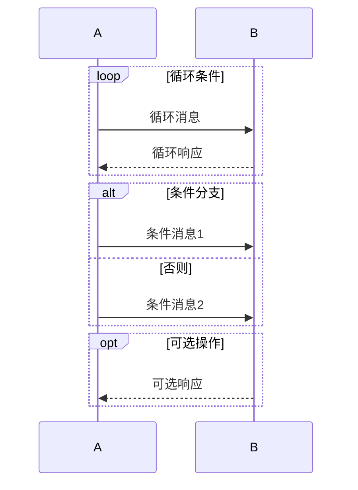

&nbsp;
# 5. 饼图 (Pie Chart)

```markdown
pie
  title 饼图示例
  "类别A": 30
  "类别B": 40
  "类别C": 30
```

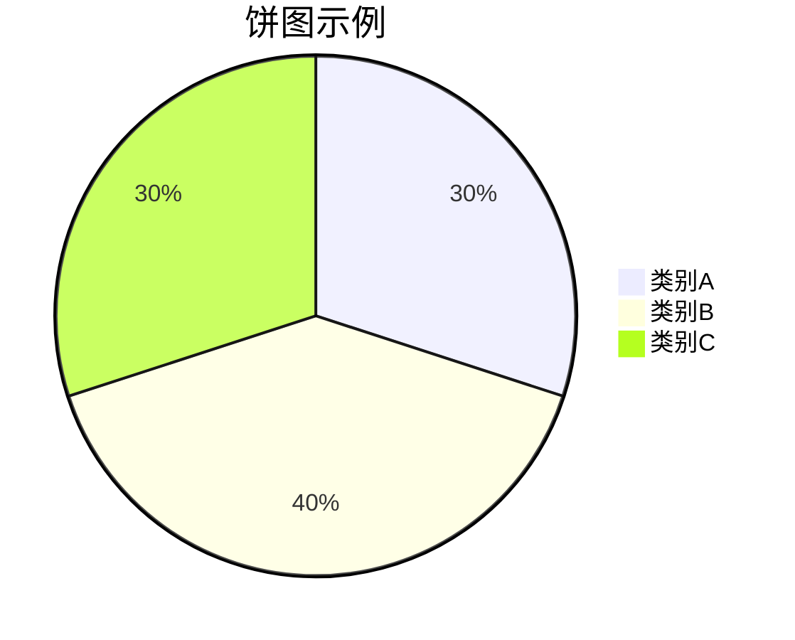

&nbsp;
# 6. 甘特图 (Gantt Chart)

## 6.1. 基本结构

```markdown
gantt
  title 甘特图示例
  dateFormat  YYYY-MM-DD
  section 部分1
  任务1           :a1, 2024-01-01, 30d
  任务2           :after a1  , 20d
  section 部分2
  任务3           :2024-02-01  , 12d
  任务4           : 24d
```

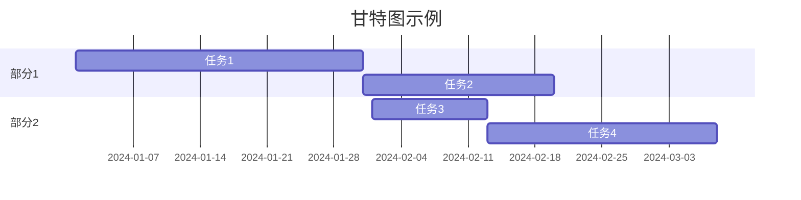

## 6.2. 任务类型

```markdown
gantt
  title 任务类型示例
  dateFormat  YYYY-MM-DD
  section 项目
  已完成任务     :done,    des1, 2024-01-01,2024-01-06
  进行中任务     :active,  des2, 2024-01-07, 3d
  未来任务1      :         des3, after des2, 5d
  未来任务2      :         des4, after des3, 5d
```

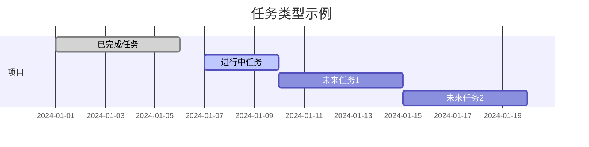

&nbsp;
# 7. 类图 (Class Diagram)

## 7.1. 基本类

```markdown
classDiagram
  class 类名 {
    +属性1: 类型
    -属性2: 类型
    #属性3: 类型
    ~属性4: 类型
    
    +方法1()
    -方法2()
    #方法3()
    ~方法4()
  }
```

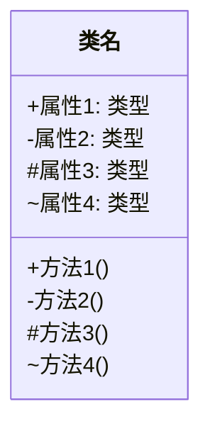

## 7.2. 类关系

```markdown
classDiagram
  类A <|-- 类B : 继承
  类C *-- 类D : 组合
  类E o-- 类F : 聚合
  类G --> 类H : 关联
  类I ..> 类J : 依赖
  类K <|.. 类L : 实现
  类M ..|> 类N : 接口实现
```

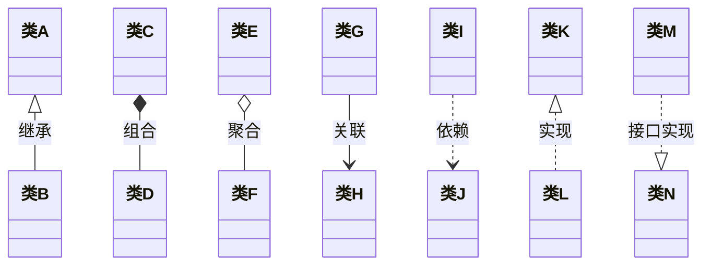

## 7.3. 复杂类图示例

```markdown
classDiagram
  class 动物 {
    +name: String
    +age: Integer
    +eat()
    +sleep()
  }
  
  class 狗 {
    +breed: String
    +bark()
  }
  
  class 猫 {
    +color: String
    +meow()
  }
  
  动物 <|-- 狗
  动物 <|-- 猫
```

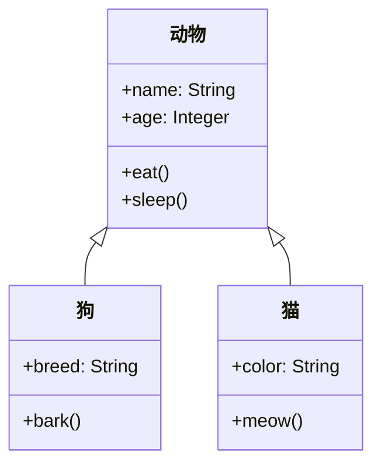

&nbsp;
# 8. 状态图 (State Diagram)

## 8.1. 基本状态

```markdown
stateDiagram-v2
  [*] --> 状态1
  状态1 --> 状态2 : 事件1
  状态2 --> 状态3 : 事件2
  状态3 --> [*] : 事件3
```

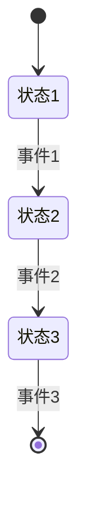

## 8.2. 复合状态

```markdown
stateDiagram-v2
  [*] --> 空闲
  
  state 空闲 {
    [*] --> 等待
    等待 --> 运行 : 开始
    运行 --> 完成 : 结束
    完成 --> [*]
  }
  
  空闲 --> 错误 : 异常
  错误 --> [*] : 重置
```

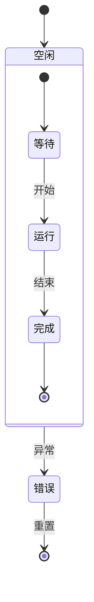

## 8.3. 并行状态

```markdown
stateDiagram-v2
  [*] --> 初始化
  
  state 并行 {
    direction LR
    state "状态A" as A
    state "状态B" as B
    
    A --> A1 : 事件A
    B --> B1 : 事件B
  }
  
  初始化 --> 并行
  并行 --> 完成
  完成 --> [*]
```

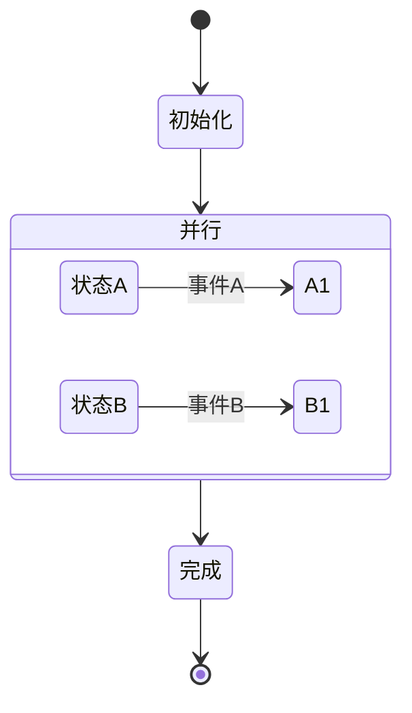

&nbsp;
# 9. 用户旅程图 (User Journey)

```markdown
journey
  title 用户旅程示例
  section 登录
    打开应用: 5: 用户
    输入凭据: 3: 用户
    验证身份: 2: 系统
    登录成功: 1: 用户
  
  section 浏览内容
    查看首页: 4: 用户
    搜索内容: 3: 用户
    显示结果: 2: 系统
    选择内容: 1: 用户
  
  section 退出
    点击退出: 3: 用户
    确认退出: 2: 系统
    退出成功: 1: 用户
```

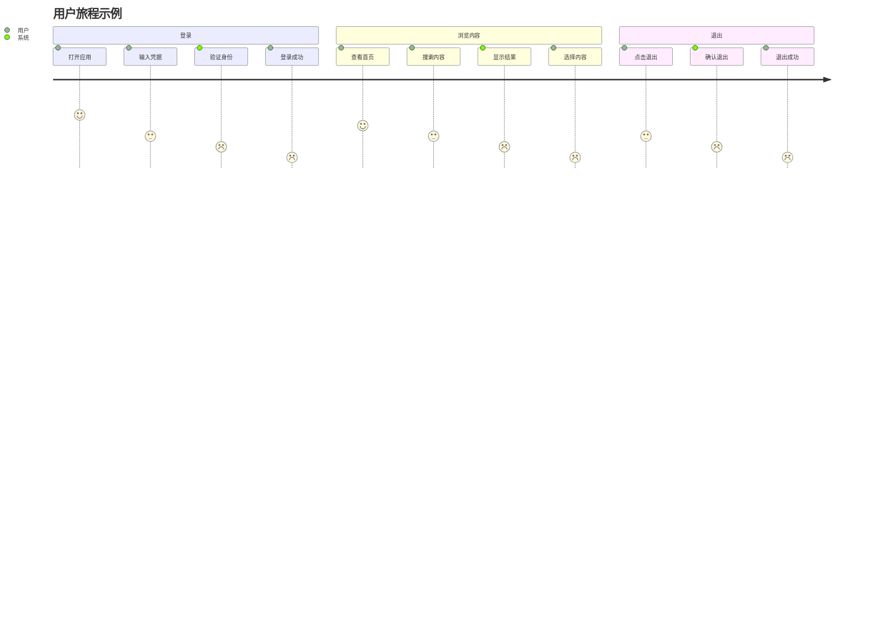

&nbsp;
# 10. 其他图表类型

## 10.1. 实体关系图 (ER Diagram)

```markdown
erDiagram
  CUSTOMER ||--o{ ORDER : places
  ORDER ||--|{ LINE-ITEM : contains
  CUSTOMER }|..|{ DELIVERY-ADDRESS : uses
```

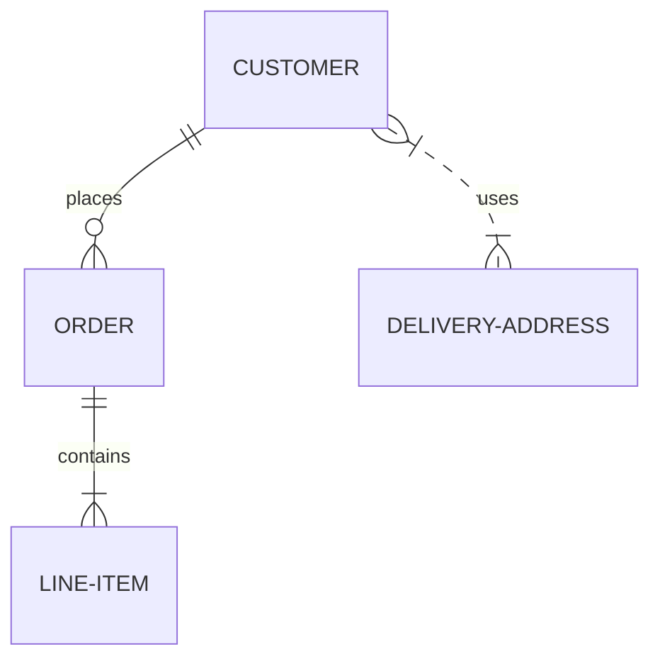

## 10.2. 思维导图 (Mind Map)

```markdown
mindmap
  root((根节点))
    分支1
      子分支1.1
      子分支1.2
    分支2
      子分支2.1
      子分支2.2
    分支3
      子分支3.1
      子分支3.2
```

```mermaid
mindmap
  root((根节点))
    分支1
      子分支1.1
      子分支1.2
    分支2
      子分支2.1
      子分支2.2
    分支3
      子分支3.1
      子分支3.2
```

## 10.3. 甘特图高级用法

```markdown
gantt
  title 项目计划
  dateFormat  YYYY-MM-DD
  axisFormat %m-%d
  
  section 设计
  需求分析           :done,    req,    2024-01-01, 2024-01-05
  系统设计           :active,  design, 2024-01-06, 2024-01-15
  数据库设计         :         db,     after design, 2024-01-20
  
  section 开发
  后端开发           :         backend, after db, 2024-01-25
  前端开发           :         frontend, after db, 2024-01-25
  API集成           :         api,     after backend, 2024-02-10
  
  section 测试
  单元测试           :         unit,    after frontend, 2024-02-15
  集成测试           :         integration, after unit, 2024-02-20
  系统测试           :         system,  after integration, 2024-02-25
  
  section 部署
  预发布环境部署     :         staging, after system, 2024-03-01
  生产环境部署       :         prod,    after staging, 2024-03-05
```

```mermaid
gantt
  title 项目计划
  dateFormat  YYYY-MM-DD
  axisFormat %m-%d
  
  section 设计
  需求分析           :done,    req,    2024-01-01, 2024-01-05
  系统设计           :active,  design, 2024-01-06, 2024-01-15
  数据库设计         :         db,     after design, 2024-01-20
  
  section 开发
  后端开发           :         backend, after db, 2024-01-25
  前端开发           :         frontend, after db, 2024-01-25
  API集成           :         api,     after backend, 2024-02-10
  
  section 测试
  单元测试           :         unit,    after frontend, 2024-02-15
  集成测试           :         integration, after unit, 2024-02-20
  系统测试           :         system,  after integration, 2024-02-25
  
  section 部署
  预发布环境部署     :         staging, after system, 2024-03-01
  生产环境部署       :         prod,    after staging, 2024-03-05
```

&nbsp;
# 11. 配置选项

## 11.1. 主题配置

```markdown
%%{init: {'theme': 'dark', 'themeVariables': {'primaryColor': '#ff0000'}}}%%
flowchart TD
  A --> B
  B --> C
```

```mermaid
%%{init: {'theme': 'dark', 'themeVariables': {'primaryColor': '#ff0000'}}}%%
flowchart TD
  A --> B
  B --> C
```

## 11.2. 字体配置

```markdown
%%{init: {'fontFamily': 'Arial', 'fontSize': 14}}%%
flowchart TD
  A --> B
  B --> C
```

```mermaid
%%{init: {'fontFamily': 'Arial', 'fontSize': 14}}%%
flowchart TD
  A --> B
  B --> C
```

&nbsp;
# 12. 最佳实践

1. **保持图表简洁**：避免在单个图表中包含过多信息
2. **使用描述性名称**：为节点和边使用清晰、描述性的名称
3. **合理组织布局**：使用子图表和适当的方向提高可读性
4. **添加注释**：使用注释解释复杂部分
5. **测试渲染**：在最终使用前测试图表渲染效果

&nbsp;
# 13. 总结

Mermaid是一个功能强大的工具，可以帮助用户快速创建各种类型的图表。通过本文的介绍，您应该已经掌握了Mermaid的基本语法和主要图表类型的使用方法。随着实践的深入，您将能够创建更加复杂和精美的图表。

更多详细信息和高级功能，请参考[Mermaid官方文档](https://mermaid.js.org/)。